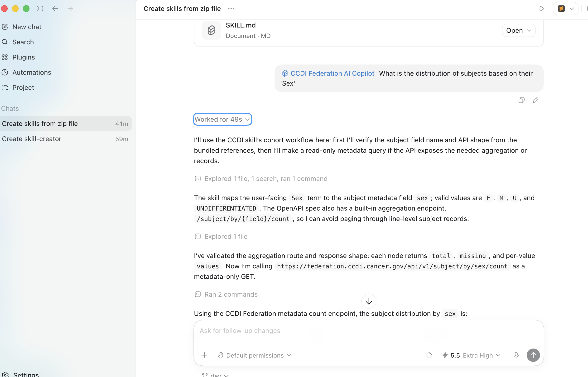
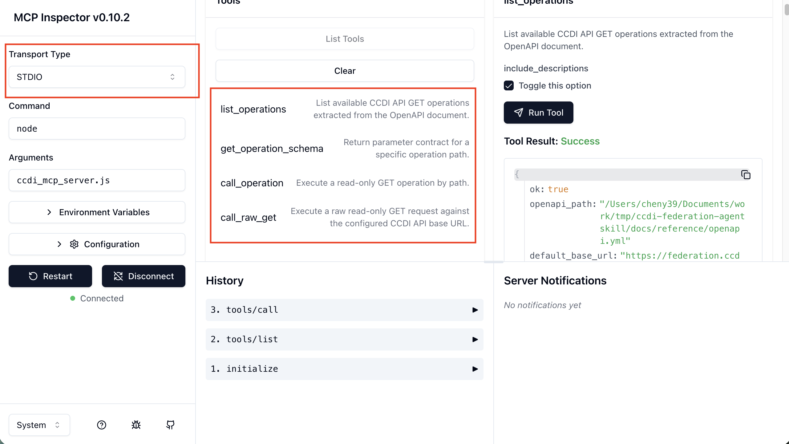

# CCDI Federation AI workspace

This repository provides components for AI-ready CCDI Federation metadata, including an AgentSkill that standardizes AI interactions through workflows and routing, and a ccdi-federation MCP server that delivers schema-aligned, read-only access to federation data.


- `skills/ccdi-federation-ai-copilot/`: AgentSkill docs, routing, and fallback scripts
- `mcp/`: `ccdi-federation` MCP server for validated read-only API calls





## Skill Install for non-developers (using Codex)
- use it in codex: [docs/instructions/codex-instruction.md](./docs/instructions/codex-instruction.md)


## Skill Install instructions for developers:

```bash
npx skills add CBIIT/ccdi-federation-agentskill
```


## MCP Server Setup

1. Install MCP dependencies:

```bash
cd mcp
npm install
npm run start
```

2. Test the MCP server with MCP Inspector:

```bash
cd mcp
npm run inspect
```

note use stdio transport 


3. Start your agent session and confirm these MCP tools are available:
- `list_operations`
- `get_operation_schema`
- `call_operation`
- `call_raw_get`

## mcp vs code/ claude code integration


Use this server registration in `.mcp.json` (update path for your machine):

```json
{
	"mcpServers": {
		"ccdi-federation": {
			"type": "stdio",
			"command": "node",
			"args": [
				"/absolute/path/to/ccdi-federation-agentskill/mcp/ccdi_mcp_server.js"
			],
			"env": {}
		}
	}
}
```

After registration, restart your agent session and verify these tools are visible:

- `list_operations`
- `get_operation_schema`
- `call_operation`
- `call_raw_get`
