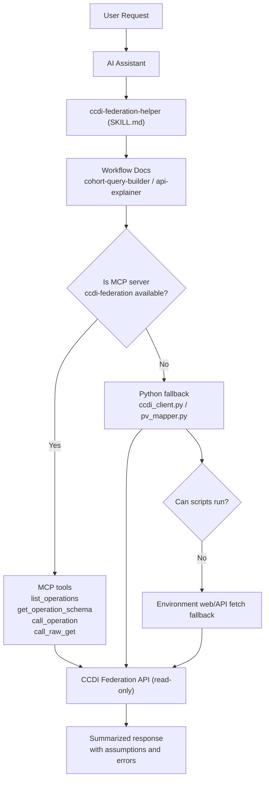

# CCDI Federation AgentSkill Design (Current Implementation)

## Goal

Provide a reusable, metadata-only AgentSkill for CCDI Federation workflows with clear routing, explicit assumptions, and safe execution.

Primary use cases:

- Cohort query planning and optional live execution
- Endpoint and response explanation
- Permissible value (PV) normalization support

## Current Repository Structure

This reflects the current workspace layout.

```text
ccdi-federation-agentskill/
├── .mcp.json
├── README.md
├── docs/
│   ├── agentskill-design.md
│   └── reference/
│       ├── about.md
│       ├── openapi.yml
│       ├── README.md
│       ├── file-api-response.json
│       ├── sample-api-response.json
│       ├── sample-diagnosis-api-response.json
│       ├── subject-api-response.json
│       ├── subject-diagnosis-api-response.json
│       └── pv/
│           ├── file-pv-metadata.json
│           ├── file-pv-metadata.md
│           ├── parse_pv_to_json.py
│           ├── sample-pv-metadata.json
│           ├── sample-pv-metadata.md
│           ├── subject-pv-metadata.json
│           └── subject-pv-metadata.md
├── mcp/
│   ├── ccdi_mcp_server.js
│   ├── package.json
│   ├── package-lock.json
│   └── README.md
├── skills-lock.json
└── skills/
    └── ccdi-federation-helper/
        ├── SKILL.md
        ├── README.md
        ├── assets/
        ├── references/
        │   ├── api-explainer.md
        │   ├── cohort-query-builder.md
        │   ├── openapi.yml
        │   └── pv/
        │       ├── file-pv-metadata.json
        │       ├── sample-pv-metadata.json
        │       └── subject-pv-metadata.json
        ├── schemas/
        └── scripts/
            ├── ccdi_client.py
            └── pv_mapper.py
```

## Architecture Overview

### Runtime Model



### Design Principle

```text
SKILL.md + references = routing, policy, reasoning
MCP server            = preferred validated API execution
Python scripts        = fallback execution and deterministic helpers
```

## Routing (Implemented)

`skills/ccdi-federation-helper/SKILL.md` currently routes to:

- Cohort Query Builder -> `references/cohort-query-builder.md`
- Endpoint or Response Explainer -> `references/api-explainer.md`

## Execution Policy (Implemented)

Execution order for live API calls:

1. Prefer MCP server `ccdi-federation`
2. If MCP is unavailable, use `scripts/ccdi_client.py`
3. If scripts cannot run, use environment web/API fetch capability

Common constraints:

- Metadata-only scope
- Read-only API access (`GET`)
- Live execution only when user explicitly asks
- Preserve assumptions, ambiguities, and per-call errors in responses

## MCP Layer (Implemented)

### Server and registration

- Server file: `mcp/ccdi_mcp_server.js`
- Registration file: `.mcp.json`
- Transport: stdio
- Registered server name: `ccdi-federation`

### Exposed MCP tools

- `list_operations`
- `get_operation_schema`
- `call_operation`
- `call_raw_get`

### Local MCP testing

From `mcp/package.json`:

- Start server: `npm run start`
- Inspect/test server: `npm run inspect`

`npm run inspect` uses MCP Inspector via:

```text
npx @modelcontextprotocol/inspector node ccdi_mcp_server.js
```

## Skill Workflow Contracts

### Cohort Query Builder

Defined in `skills/ccdi-federation-helper/references/cohort-query-builder.md`.

Current contract:

1. Interpret cohort intent
2. Identify entity scope (`subject`, `sample`, `file`, or cross-entity)
3. Normalize controlled values with PV metadata
4. Validate route and parameters against `./openapi.yml`
5. Optionally execute live metadata calls (explicit user request only) with MCP-first fallback
6. Return concise summary with assumptions, ambiguities, and limits

Current defaults:

- Page size default: 10
- Max pages default: 3
- Stop pagination on empty page, short page, missing/repeated token, error, or cap reached

### API Explainer

Defined in `skills/ccdi-federation-helper/references/api-explainer.md`.

Current contract:

- Explain endpoint purpose, methods, parameter usage, pagination, and response shape
- Keep explanations aligned with the local OpenAPI source

## Python Fallback Scripts (Implemented)

### `scripts/ccdi_client.py`

- Builds metadata-only GET request URLs
- Executes read-only GET calls with timeout/retry controls
- Returns structured success/error envelope with parsed JSON payload when available

### `scripts/pv_mapper.py`

- Loads PV metadata for `file`, `sample`, and `subject`
- Lists controlled fields
- Retrieves permissible values for a field
- Validates field/value pair existence
- Returns field-level metadata helpers

## Notes and Scope Boundaries

- This implementation is intentionally lightweight and policy-driven.
- Workflow behavior is mostly encoded in markdown instructions, not a large orchestration code layer.
- Future modules can be added, but must preserve metadata-only and read-only guardrails.
