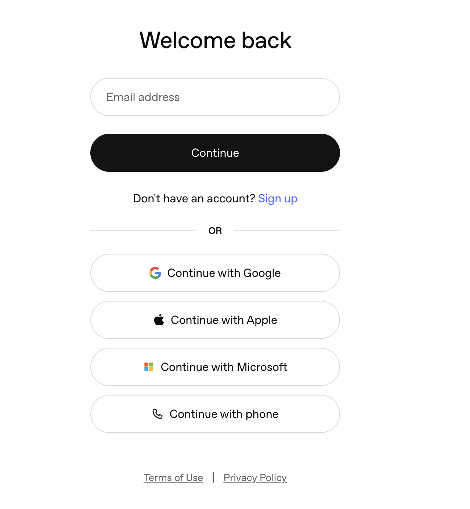
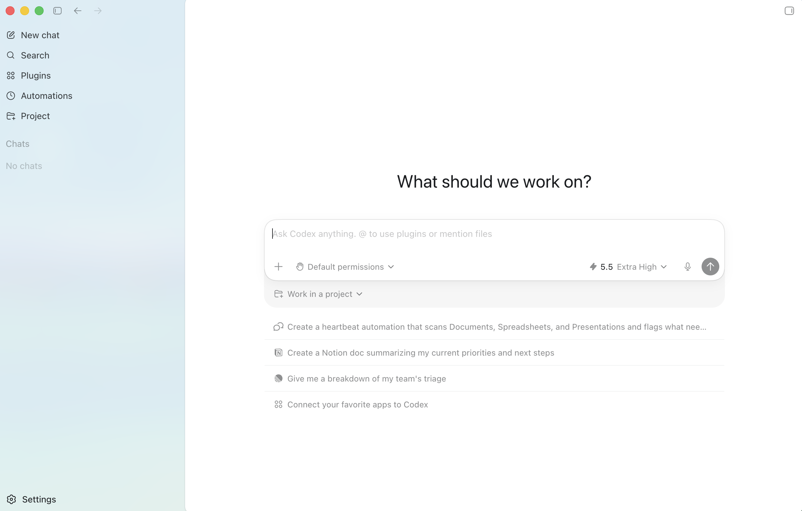
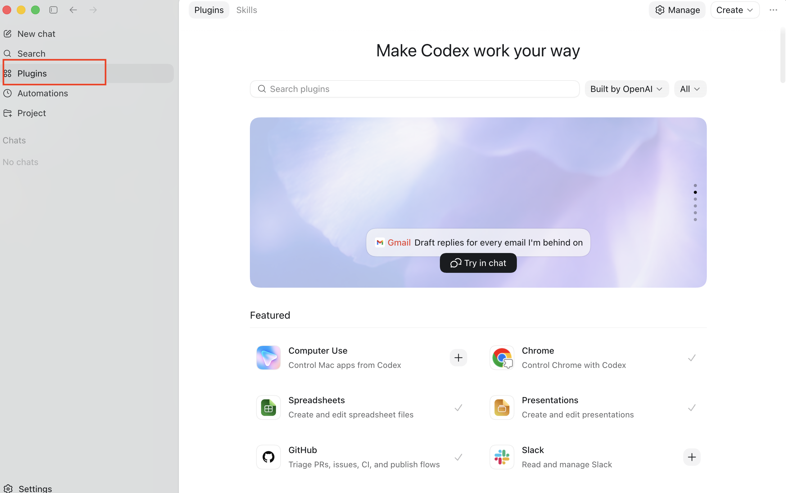
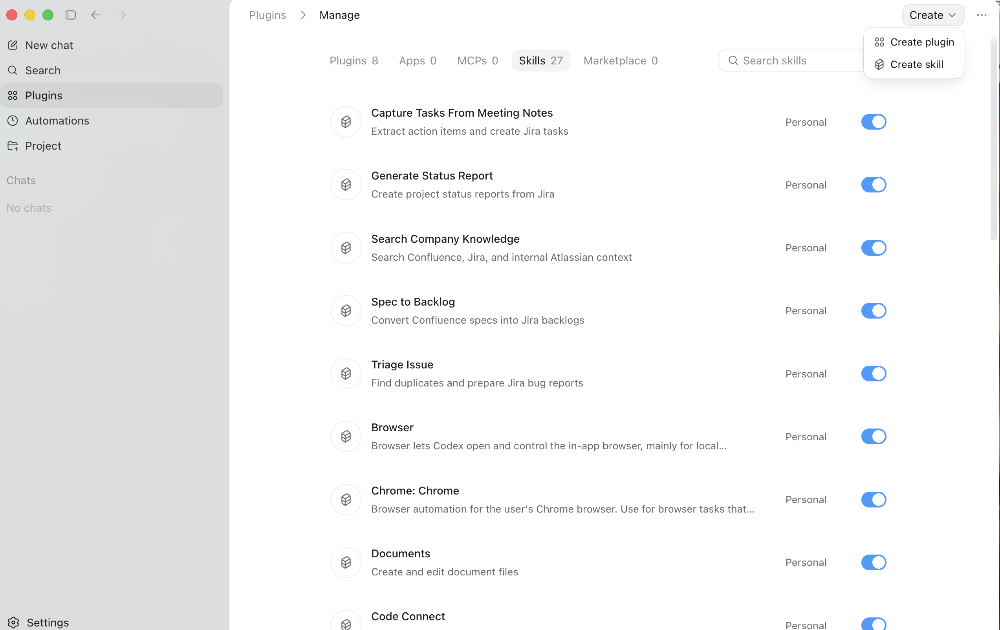
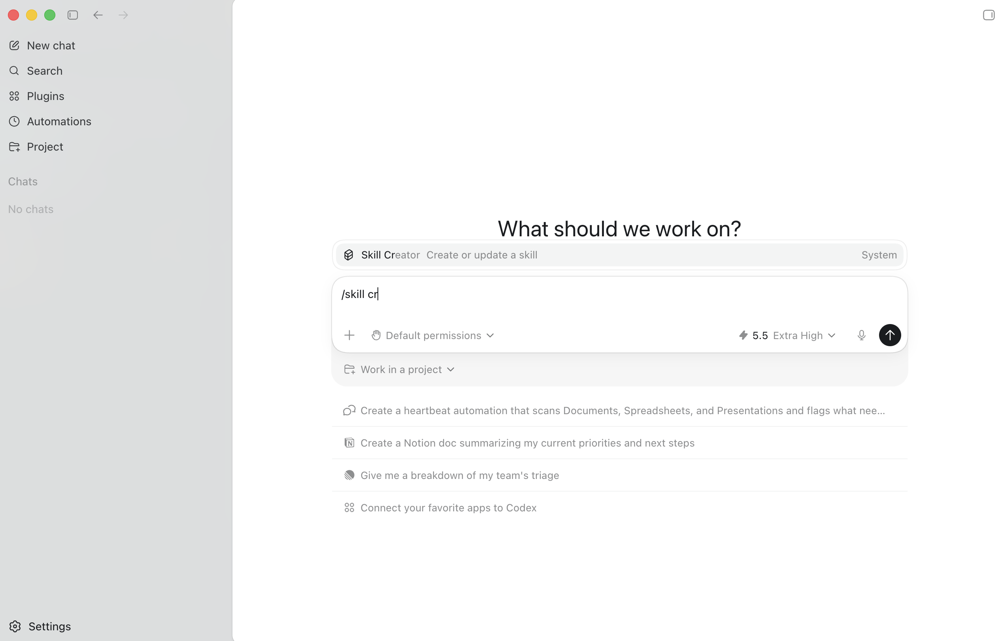
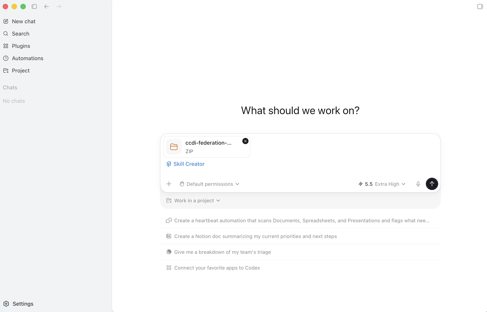
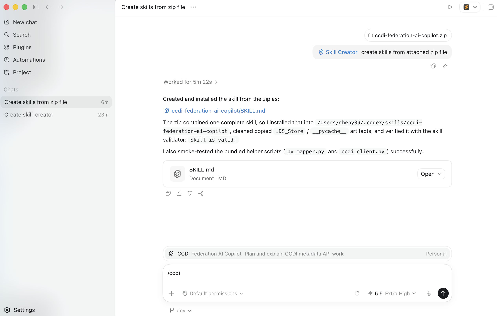
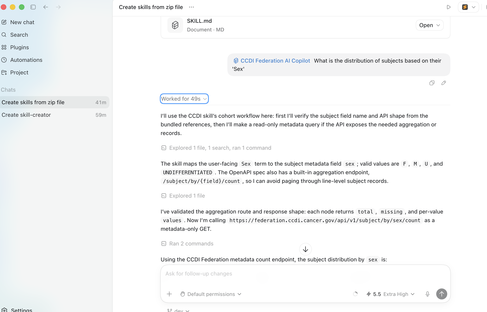

# ChatGPT Skills: Installation, Management, and Usage Guide

This guide explains how to:

- Open ChatGPT
- Sign in
- Create and install skills
- Upload custom skills
- Manage skills
- Use skills effectively

---

## Open ChatGPT

Go to:

<https://chatgpt.com/>

Use ChatGPT through the web or supported desktop environments.

After opening the page, click:

- Click **Continue with ChatGPT**

---

## Sign In

Sign in using one of the following:

- Google
- Apple
- Microsoft
- Email
- Phone

After signing in, you will enter the ChatGPT workspace.

HHS users can use their HHS email to sign in to access their HHS-specific ChatGPT workspace.

---

## ChatGPT Workspace

The workspace allows you to:

- Interact via chat
- Use plugins and skills
- Upload files
- Execute workflows

---

## Open the Plugins Panel

From the left sidebar:

- Click **Plugins**

This section contains:

- Skills
- Plugins
- Integrations

---

## Create a Skill

### Option A: Using the Interface

- Click **Manage**
- Click **Create**
- Select **Create skill**

---

### Option B: Using Command

In the chat input, enter: /skill create
This opens the Skill Creator.

---

## Upload a Skill Package

To install a custom skill:

- Drag and drop a `ccdi-federation-ai-copilot.zip` file into the chat
- Ensure **Skill Creator** is selected
- Submit the request

ChatGPT will automatically:

- Parse the package
- Create the skill
- Register it in the system

## Using Skills

Skills are used directly within the ChatGPT chat interface. There are several ways to invoke them.

### Explicit Invocation

You can explicitly direct ChatGPT to use a specific skill. By typing the skill name, such as /ccdi-federation-ai-copilot, you can ensure that ChatGPT uses that skill for your request.

